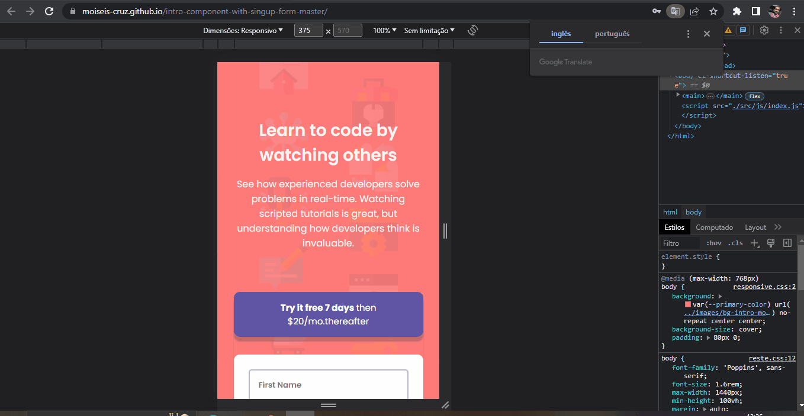

# intro-component-with-signup-form-master

O Intro <strong>Component With Signup Form Master</strong> é um formulário de inscrição com o preenchimento obrigatório dos campos de inscrição.

Minha dificuldade foi como realizar as validações dos campos. Para isso usei a condição `if/else`, dentro do forEach para trabalhar com todos os campos. Usei ele dentro de um evento de submit.
Desse jeito, usando o evento de submit, eu posso confirmar os meu dados tanto ao clicar no botão quanto digitando a tecla ENTER em qualquer campo de preenchimento. Enquanto que pelo evento de click só posso validar a inscrição clicando no botão.

## Tecnologias Utilizadas:

- HTML;
- CSS;
- JavaScript (JS);

